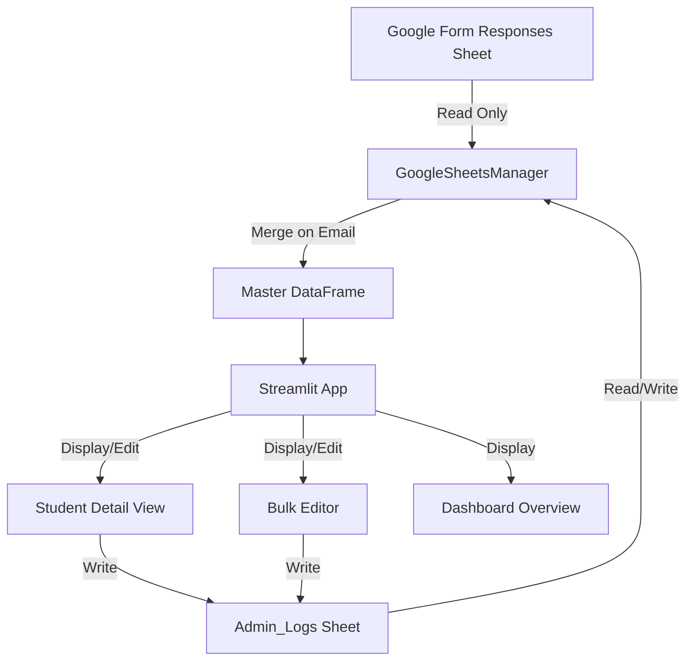

# Gemini Course Operations Dashboard Implementation Plan

## Architecture Overview

The application will use Streamlit as the frontend framework, with a `GoogleSheetsManager` class handling all Google Sheets API operations. Data flows between the Form Responses sheet (read-only) and the Admin_Logs sheet (read/write), merged on "Email Address".



## Project Structure

```
Trainee Dashboard/
├── app.py                    # Main Streamlit application
├── google_sheets_manager.py  # Google Sheets API wrapper class
├── utils.py                  # Helper functions (data merging, formatting)
├── requirements.txt          # Python dependencies
├── .streamlit/
│   └── secrets.toml.example  # Template for secrets configuration
├── README.md                 # Setup and usage instructions
└── credentials/              # (gitignored - user adds service account JSON here)
    └── service_account.json
```

## Implementation Details

### 1. Dependencies (`requirements.txt`)

- streamlit (latest)
- pandas
- gspread
- google-auth
- python-dotenv (optional, for local dev)

### 2. Configuration Template (`.streamlit/secrets.toml.example`)

Template for Google Sheets configuration including:

- Spreadsheet ID
- Worksheet names (Form Responses, Admin_Logs)
- Service account credentials (user will add actual JSON)

### 3. Google Sheets Manager (`google_sheets_manager.py`)

Class `GoogleSheetsManager` with methods:

- `__init__()`: Initialize with service account credentials from secrets
- `read_form_responses()`: Read from "Form Responses 1" sheet
- `read_admin_logs()`: Read from "Admin_Logs" sheet
- `initialize_student_row(email, student_data)`: Create new row in Admin_Logs for new students
- `update_student_data(email, updates)`: Update specific student's data in Admin_Logs
- `bulk_update_admin_logs(df)`: Write entire DataFrame to Admin_Logs
- `get_all_data()`: Merge Form Responses + Admin_Logs on Email Address

### 4. Utilities (`utils.py`)

Helper functions:

- `merge_student_data(form_df, admin_df)`: Merge dataframes on Email Address
- `detect_new_students(form_df, admin_df)`: Find students in form but not in admin
- `format_attendance(attendance_dict)`: Convert attendance dict to/from string/JSON
- `validate_email_list(emails)`: Format emails for export

### 5. Main Application (`app.py`)

Streamlit app with sidebar navigation:

#### 5.1 Home Page (Dashboard Overview)

- Metrics: Total Students, Total Paid, % Onboarding Complete (resume uploaded)
- Status Table: Students with missing payments or resumes
- Email Export: Button to copy all student emails

#### 5.2 Student Detail View

- Student selector (selectbox)
- Profile display: Name, Email, Resume Link (markdown link), Parent Name, Referrer
- Input Form:
  - Payment Status: `st.selectbox` (Paid/Pending/Unpaid)
  - Attendance: `st.checkbox` for each session (Class 1, Class 2, Lab 1, Lab 2)
  - Grades: `st.number_input` or `st.selectbox` for Assignment 1, Assignment 2
  - Teacher Evaluation: `st.text_area` (large, multi-line)
- Submit button: Calls `update_student_data()`

#### 5.3 Bulk Editor

- Use `st.data_editor` to display/edit all students
- Editable columns: Payment Status, Attendance (as formatted string), Grades, Evaluation
- Save button: Calls `bulk_update_admin_logs()`
- Warning message about overwriting data

#### 5.4 Error Handling

- Try/except blocks around Google Sheets operations
- User-friendly error messages via `st.error()`
- "Refresh Data" button to reload from sheets
- Connection timeout handling

## Data Schema

**Form Responses 1** (Read-only):

- Timestamp
- Email Address
- Name
- Resume Link
- Parent Name
- Referrer

**Admin_Logs** (Read/Write):

- Email Address (primary key)
- Payment Status (Paid/Pending/Unpaid)
- Attendance (JSON string: `{"Class 1": true, "Class 2": false, ...}`)
- Assignment 1 Grade (number/string)
- Assignment 2 Grade (number/string)
- Teacher Evaluation (long text)

## Key Implementation Notes

1. **Data Merging**: Merge on "Email Address" with left join from Form Responses to ensure all registered students appear
2. **New Student Initialization**: When detecting new students, automatically create rows in Admin_Logs with default values
3. **Attendance Storage**: Store as JSON string in Admin_Logs for easy parsing and editing
4. **Resume Link**: Display as clickable markdown link in Streamlit
5. **Bulk Updates**: Use `st.data_editor` with column configuration for appropriate input types
6. **State Management**: Use `st.session_state` to cache loaded data and minimize API calls

## Files to Create

1. `requirements.txt` - Python dependencies
2. `.streamlit/secrets.toml.example` - Configuration template
3. `google_sheets_manager.py` - Google Sheets API wrapper
4. `utils.py` - Helper functions
5. `app.py` - Main S