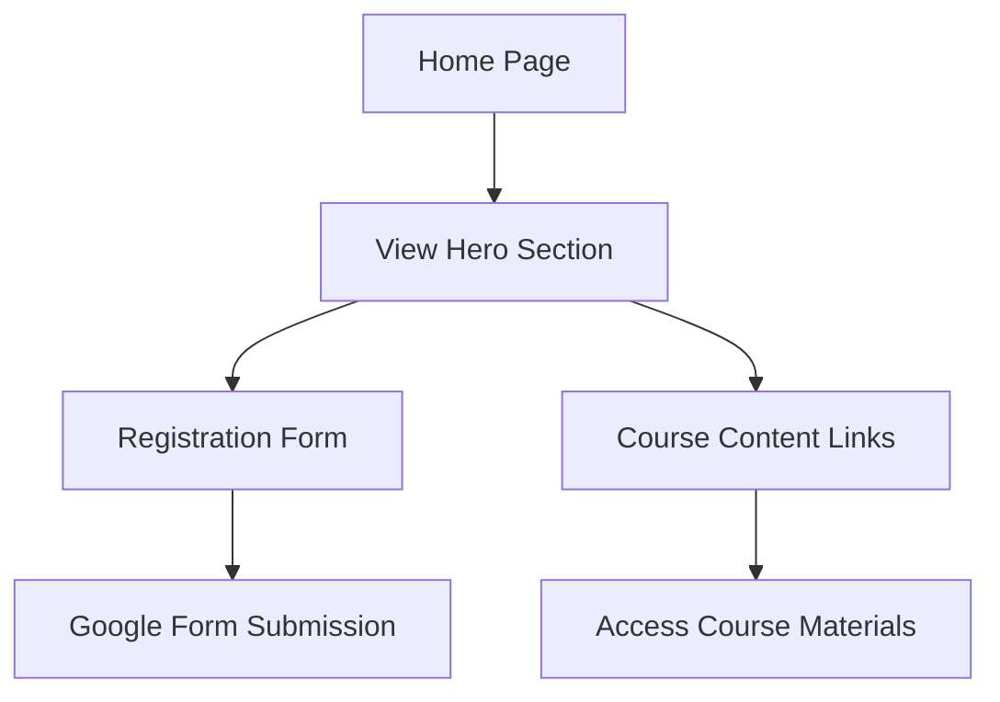

## 1. Product Overview
A registration-focused landing page for the "Gemini 3 Masterclass" course website. Users can register through an embedded Google Form and access course content via dynamic links. The site features a professional design with yellow and dark navy blue theming.

Target audience: Professionals interested in AI/tech masterclass courses.

## 2. Core Features

### 2.1 User Roles
| Role | Registration Method | Core Permissions |
|------|---------------------|------------------|
| Visitor | No registration required | View website, access course content links, submit registration form |

### 2.2 Feature Module
The Gemini 3 Masterclass website consists of the following main pages:
1. **Home page**: Hero section with course branding, registration form integration, dynamic course content links section.

### 2.3 Page Details
| Page Name | Module Name | Feature description |
|-----------|-------------|---------------------|
| Home page | Hero section | Display "GEMINI 3 MASTERCLASS" branding with yellow and white text over dark blue background. Include course subtitle "From Idea to Build in 3 Weeks". |
| Home page | Registration form | Embed Google Form for course registration. Form submissions go directly to the configured Google Form. |
| Home page | Course content links | Display clickable boxes for course materials (Word documents). New boxes appear dynamically when additional links are added. |
| Home page | Navigation | Simple navigation with smooth scrolling to different sections. |

## 3. Core Process
Visitor Flow:
1. User lands on homepage and views hero section with course branding
2. User can scroll to registration section and fill out embedded Google Form
3. User can access course content by clicking on link boxes
4. New course content links automatically appear as they are added

## 4. User Interface Design

### 4.1 Design Style
- **Primary colors**: Dark navy blue (#1a2332), Bright yellow (#ffd700)
- **Secondary colors**: White (#ffffff) for text contrast
- **Button style**: Rounded corners with yellow background and white text
- **Font**: Modern sans-serif, bold for headings
- **Layout style**: Single-page scroll design with distinct sections
- **Icon style**: Minimalist icons for course content boxes

### 4.2 Page Design Overview
| Page Name | Module Name | UI Elements |
|-----------|-------------|-------------|
| Home page | Hero section | Full-width banner with dark blue overlay, yellow vertical accent bar, "GEMINI 3" in large yellow text, "MASTERCLASS" in white below, subtitle in yellow |
| Home page | Registration form | Centered Google Form embed with responsive iframe, yellow accent border |
| Home page | Course content links | Grid layout of clickable boxes, each with document icon and title, yellow hover effects, dynamically added boxes maintain consistent styling |

### 4.3 Responsiveness
Desktop-first design approach with mobile responsiveness. Hero text scales appropriately, registration form maintains usability on mobile devices, course content links reflow from grid to single column on smaller screens.

### 4.4 Asset Requirements
- Hero background image (classroom/workshop photo with blue overlay effect)
- Document icon for course content links
- Yellow vertical accent bar graphic