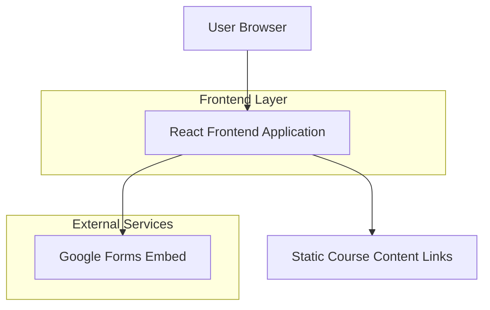

## 1. Architecture design

## 2. Technology Description
- Frontend: React@18 + tailwindcss@3 + vite
- Initialization Tool: vite-init
- Backend: None (static site with Google Forms integration)

## 3. Route definitions
| Route | Purpose |
|-------|---------|
| / | Homepage with hero section, registration form, and course content links |

## 4. Component Structure

### 4.1 Core Components
- `HeroSection`: Displays branding with yellow/blue theme
- `RegistrationForm`: Embeds Google Form iframe
- `CourseContentLinks`: Dynamic grid of course material links
- `LinkBox`: Individual clickable box component for course content

### 4.2 Data Management
Course content links stored in component state or JSON configuration file for easy dynamic updates.

## 5. Asset Management
- Hero background image: `/assets/hero-background.jpg`
- Document icons: `/assets/document-icon.svg`
